目录

[1.1 计算机网络在信息时代的作用](#1.1)

[1.2 因特网概述](#1.2)

[1.3 三种交换方式](#1.3)

[1.4 计算机网络的定义和分类](#1.4)

[1.5 计算机网络的性能指标](#1.5)

[1.6 计算机网络体系结构](#1.6)

#### 图示说明

代表着主机

 代表服务器

 代表着路由器

 代表着网络

<h2 id="1.1">1.1、计算机网络在信息时代的作用</h2>

* 常见的网络有电信网络（提供电话、电报及传真等服务）、有线电视网络（向用户传送各种节目）、计算机网络（使用户在计算机之间传输、浏览各种数据文件）等。
    * 发展最快，起到核心作用的是计算机网络。
    * 计算机网络主要是由一些通用的、可编程的硬件互连而成的，而这些硬件并非专门用来实现某一特定目的（例如，传送数据或视频信号）。这些可编程的硬件能够用来传送多种不同类型的数据，并能支持广泛的和日益增长的应用。

* 计算机网络已由一种**通信基础设施**发展成为一种重要的**信息服务基础设施**
* 计算机网络已经像水，电，煤气这些基础设施一样，成为我们**生活中不可或缺**的一部分

<h2 id="1.2">1.2、因特网概述</h2>

### 1、网络、互连网（互联网）和因特网

* **网络**：网络（Network）由若干 **结点**（Node）和连接这些结点的 **链路**（Link）组成。
    * **结点**：又称 **节点**。
        * 主机节点：指主机及其上运行的应用程序；
        * 数据交换节点：路由器、交换机等网络设备。
    * **链路**：又称通信链路。指一个节点到相邻节点的一段 **物理线路**
        * 接入网链路：主机连接到互联网的链路
        * 主干链路：路由器间的链路
    * 协议：对等层实体在通信过程中应该遵守的规则的集合

        ::: tip 结点与节点
        结点：数据结构的物理存储结构。
        节点：在计算机网络中通常指拥有数据存储、转发能力的计算机设备终端。
        在计算机网络中两者可以通用。
        :::

* 互连网（互联网）：多个网络通过路由器互连起来，这样就构成了一个覆盖范围更大的网络，即互连网（互联网）。因此，互联网又称为“网络的网络（Network of Networks）”。
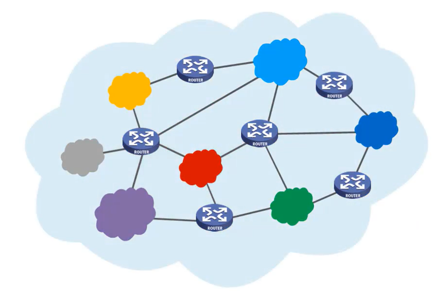

* 因特网：因特网（Internet）是世界上最大的互连网络（用户数以亿计，互连的网络数以百万计）。
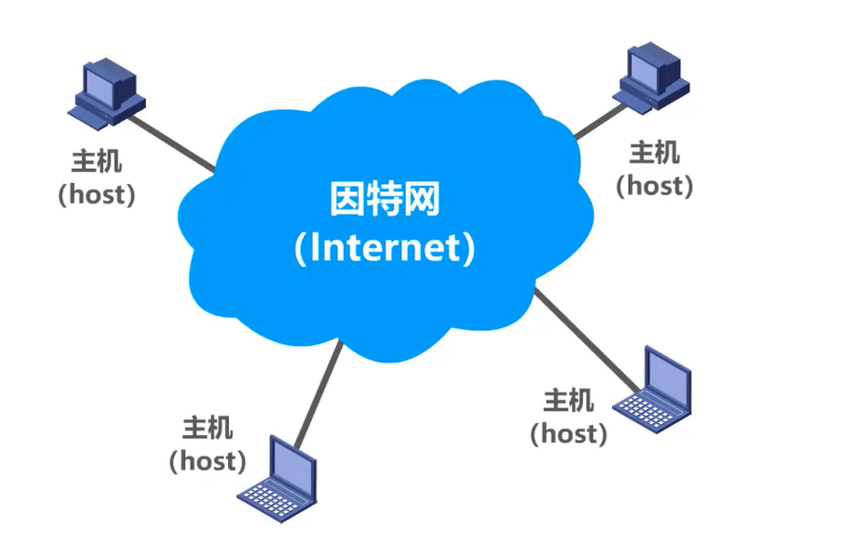

::: tip internet 与 Internet 的区别
* **internet(互联网或互连网)** 是一个抽象的通用名词，它泛指 **多个计算机网络互连而成的网络**。在这些网络之间的通信协议可以是任意的。
* **Internet（因特网）则是一个专用名词**，它指**当前全球最大的、开放的、由众多网络互连而成的特定计算机网络**，它采用TCP/IP协议族作为通信的规则，其前身是美国的ARPANET。

**任意把几个计算机网络互连起来（不管采用什么协议），并能够相互通信，这样构成的是一个互连网(internet) ，而不是互联网(Internet)。**
:::

### 2、因特网发展的三个阶段

* 第一阶段：从单个网络 ARPANET 向互联网发展的过程。
    * 1983 年，TCP/IP 协议成为 ARPANET 上的标准协议，使得所有使用 TCP/IP 协议的计算机都能利用互连网相互通信。
    * 人们把 1983 年作为互联网的诞生时间。
    * 1990年，ARPANET 正式宣布关闭。
* 第二阶段：建成了三级结构的互联网。 
    * 它是一个三级计算机网络，分为主干网、地区网和校园网（或企业网）。
* 第三阶段：逐渐形成了多层次 ISP 结构的互联网。
    * 出现了**互联网服务提供者** ISP (Internet Service Provider)。
    * 任何机构和个人只要向某个 ISP 交纳规定的费用，就可从该 ISP 获取所需 IP 地址的使用权，并可通过该 ISP 接入到互联网。
    * 根据提供服务的覆盖面积大小以及所拥有的IP地址数目的不同，ISP 也分成为不同层次的 ISP：主干 ISP、地区 ISP和本地 ISP。
    * IP地址分配

---
#### 因特网服务提供者`ISP`(`I`nternet `S`ervice `P`rovider)

::: tip 普通用户是如何接入到因特网的呢？
答：**通过ISP接入因特网**
ISP可以从因特网管理机构申请到成块的IP地址，同时拥有通信线路以及路由器等联网设备。任何机构和个人只需缴纳费用，就可从**ISP得到所需要的IP地址**。
**因为因特网上的主机都必须有IP地址才能进行通信，这样就可以通过该ISP接入到因特网**
:::
**中国的三大`ISP`：中国电信，中国联通和中国移动**

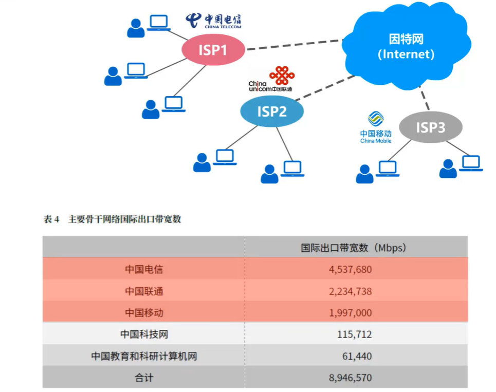

**基于ISP的三层结构的因特网**

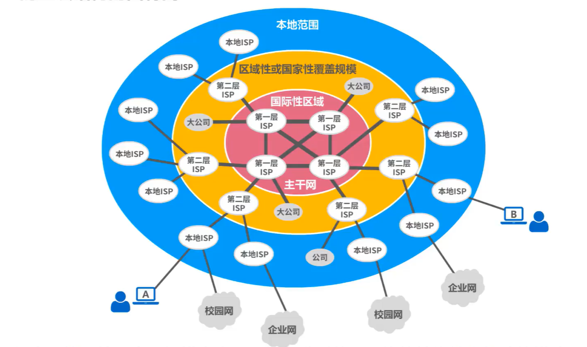

> 一旦某个用户能够接入到因特网，那么他也可以成为一个ISP，所需要做的就是购买一些如调制解调器或路由器这样的设备，让其他用户可以和他相连。

### 3、因特网的标准化工作

* 因特网标准由因特网工程任务组（Internet Engineering Task Force，IETF）研发。
    * 因特网在指定其标准上的一个很大的特点是**面向公众。**
    * IETF的标准文档叫做**请求评论** **RFC**(Request For Comments)，均可从因特网上免费下载；
    * 任何人都可以随时用电子邮件发表对某个文档的意见或建议。
    * `IEEE 802 LAN/MAN` 标准化委员会制定了以太网和无线WiFi的标准。

* **因特网协会ISOC**是一个国际性组织，它负责对因特网进行全面管理，以及在世界范围内促进其发展和使用。
    * 因特网体系结构委员会IAB，负责管理因特网有关协议的开发；
    * 因特网工程部IETF，负责研究中短期工程问题，主要针对协议的开发和标准化；
    * 因特网研究部IRTF，从事理论方面的研究和开发一些需要长期考虑的问题。
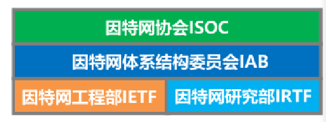

* 制订因特网的正式标准要经过一下**4个阶段**：
1. 因特网草案（在这个阶段还不是RFC文档）
2. 建议标准（从这个阶段开始就成为RFC文档）
3. 草案标准
4. 因特网标准
---
### 4、因特网的组成

#### 1. 边缘部分 network edge
* 边缘系统上运行的应用是网络存在的理由。

* 由所有连接在因特网上的 **主机** 组成，这些主机又称为 **端系统** (end system)。（台式电脑，大型服务器，笔记本电脑，平板，智能手机等）。这部分是 **用户直接使用** 的，用来进行 **通信** （传送数据、音频或视频）和 **资源共享**。

* 端系统通过 **通信链路** 和 **分组交换机** 连接到一起。

* 端系统通过 `ISP` 接入互联网。

* **端系统在功能上可能有很大的差别：**
    * 小的端系统可以是一台普通个人电脑，具有上网功能的智能手机，甚至是一个很小的网络摄像头。
    * 大的端系统则可以是一台非常昂贵的大型计算机。
    * 端系统的拥有者可以是个人，也可以是单位（如学校、企业、政府机关等），当然也可以是某个ISP。

#### 2. 核心部分 network core

* 由 **大量网络** 和连接这些网络的 **路由器** 组成。这部分是 **为边缘部分提供服务** 的（提供连通性和交换）。
    * 路由器是一种专用计算机，但我们不称它为主机，路由器是实现分组交换的关键构件，其任务是转发收到的分组，这是网络核心最重要的部分。

#### 3. 接入网 access network
* 接入网：将 **端系统** 连接到边缘路由器（*edge router*）的物理链路。
    * 边缘路由器：端系统到任何其他远程端系统的路径上的第一台路由器。

1. 家庭接入：DSL，电缆，FTTH，拨号和卫星
    * **用户数据线**DSL( `digital subscriber line` )：以电话线为传输介质的传输技术组合，即**拨号上网**。
        * 当使用拨号上网时，用户本地的电话公司就是他的 **ISP**。用户的**调制解调器**（modem，俗称猫）使用**电话线**和电话公司的**数字用户线路接入复用器**( `Digital Subscriber Line Access Multiplexer` )进行通信。猫将计算机的数字信号转换为模拟信号（音频信号），DSLAM将汇集的许多用户的模拟信号转换为数字信号发送网络。
        * 频分复用技术：电话线同时承载数据和电话信号，它们被编码为不同的频率。一条电话线可以同时传输因特网数据信号和电话信号，分频器把它们分离开来并转发。
            * 高速下行信道，50 kHz to 1 MHz
            * 中速上行信道，4 kHz to 50 kHz
            * 原始双向电话信道，0 to 4 kHz
        * 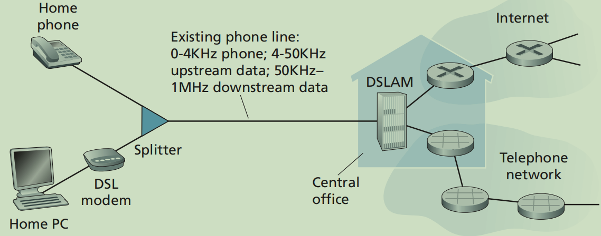

    * 电缆( `cable` )：利用了有线电视基础设施。
        * 共享带宽
        * 
    * 光纤到户( `Fiber To The Home` ，FTTH)：从本地中心局直接到家庭提供一条光线路径。
2. 企业（和家庭）接入：以太网和WiFi
    企业、大学、家庭通常使用局域网将端用户连接到边缘路由器。
    * 以太网( `Ethernet` )：最流行的局域网(local area network,LAN)接入技术。以太网用户与一台以太网交换机（ `switch` ）相连，交换机则与更大的因特网相连。
        * 用户能达到100Mbps，服务器能达到1Gbps.
    * 无线局域网( `wifi` )：基于 `IEEE 802.11` 技术的无线局域网接入。在无线LAN环境中，用户通过一个**无线接入点**（Wireless Access Point）收发分组。用户必须位于该接入点几十米范围内。
    * 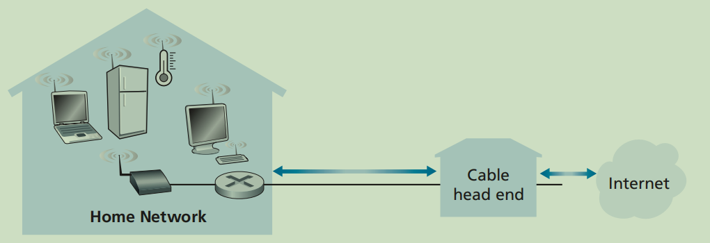
    这个家庭网络由以下构成：一台漫游笔记本、多个联网家用电器、一台有线PC、一个用于连接无线PC和其他无线设备的基站（无线接入点）、一个连接了无线AP和其他有线设备到网络的路由器。
3. 广域无线接入：3G、LTE 4G、5G
    * 移动设备使用与移动电话相同的基础设施，通过蜂窝网运营商的基站收发分组。与WiFi不同的是用户只需要位于基站数万米范围内即可。
#### 4. 端系统之间的通信模式

“主机 A 和主机 B 进行通信”实际上是指：“运行在主机 A 上的某个程序和运行在主机 B 上的另一个程序进行通信”。**即“主机** **A** **的某个进程和主机** **B** **上的另一个进程进行通信”。简称为“计算机之间通信”。** 

端系统之间的通信方式通常可划分为两大类：

* **客户-服务器方式：**
    * 客户 (client) 和服务器 (server) 都是指通信中所涉及的两个应用进程。
    * 客户 - 服务器方式所描述的是进程之间服务和被服务的关系。
    * 客户是服务的请求方，服务器是服务的提供方。

> **服务请求方和服务提供方都要使用网络核心部分所提供的服务。**

* **对等连接方式：**
    * **对等连接** (peer-to-peer，简写为 **P2P** ) 是指两个主机在通信时并不区分哪一个是服务请求方还是服务提供方。
    * 只要两个主机都运行了对等连接软件 ( P2P 软件) ，它们就可以进行**平等的、对等连接通信**。
    * 双方都可以下载对方已经存储在硬盘中的共享文档。 
------

<h2 id="1.3">1.3 三种交换方式</h2>

* 网络核心部分是互联网中最复杂的部分。

* 网络中的核心部分要向网络边缘中的大量主机提供连通性，使边缘部分中的任何一个主机都能够向其他主机通信（即传送或接收各种形式的数据）。

* 在网络核心部分起特殊作用的是**路由器**(router)。

* **路由器**是实现**分组交换** (packet switching) 的关键构件，其任务是**转发**收到的分组，这是网络核心部分最重要的功能。

### 1、电路交换（Circuit Switching）

* 又称**线路交换**。传统两两相连的方式，N 部电话机两两直接相连，需 N(N –1)/2 对电线。这种直接连接方法所需要的电线对的数量与电话机数量的平方（N 2）成正比。
* 所以要使得每一部电话能够很方便地和另一部电话进行通信，就应该使用一个**中间设备**将这些电话连接起来，这个中间设备就是**电话交换机**
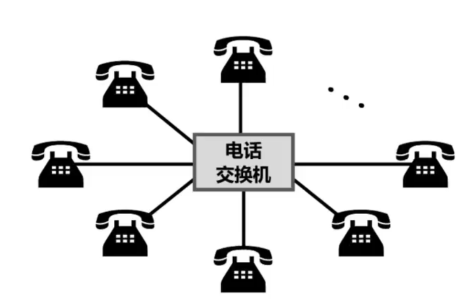

* 电话交换机接通电话线的方式称为电路交换；

* 从通信资源的分配角度来看，交换（Switching）就是按照某种方式动态地分配传输线路的资源；

* 电路交换的三个步骤：

  1、建立连接（分配通信资源，建立起一条端到端的物理线路）

  2、通话（一直占用通信资源传输数据）

  3、释放连接（归还通信资源）

::: tip 
电路交换是**面向连接**的服务。它需要为通信双方建立起一个实际的物理连接。当使用电路交换来传送计算机数据时，其线路的传输效率往往很低。
这是因为计算机数据是突发式地出现在传输线路上的。
所以计算机通常采用的是**分组交换**，而不是线路交换
:::

### 2、分组交换（Packet Switching）

通常我们把表示**该消息的整块数据**称为一个**报文**。
* 在发送报文之前，先把较长的报文划分成一个个更小的**等长数据段**，在每一个数据段前面。加上一些由必**要的控制信息组成的首部**后，就构成一个**分组**（packet），也可简称为“包”，相应地，首部也可称为“包头”。
* 每一个分组的首部都含有地址（诸如**目的地址**和**源地址**）等控制信息。
* 分组交换网以“分组”作为数据传输单元。依次把各分组发送到接收端。分组交换网中的**结点交换机**（路由器）根据收到的分组首部中的地址信息，把分组转发到下一个**结点交换机**。
    * 每个分组在互联网中**独立地**选择传输路径。

* 接收端收到分组后剥去首部还原成报文。
---
#### 发送方

* 构造分组
* 发送分组

#### 路由器

* 在路由器中的输入和输出端口之间没有直接连线。
* 路由器需要经常交换彼此路由信息，维护路由器的转发表，及时更新网络拓扑变化情况 （泛洪Flooding）
* 路由器处理分组的过程是：
    * 把收到的分组先放入**缓存队列**（暂时存储）；
    * 查找**转发表**，找出到某个目的地址应从哪个端口转发；
    * 把分组送到适当的端口转发出去。

#### 接收方

* 接收分组
* 还原报文

::: tip 主机和路由器的作用不同
* 主机是为用户进行信息处理的，并向网络发送分组，从网络接收分组。
* 路由器对分组进行存储转发，最后把分组交付目的主机。
:::

#### 分组交换的优点
* **高效**：在分组传输的过程中动态分配传输带宽，对通信链路是逐段占用。
* **灵活**：为每一个分组独立地选择最合适的转发路由。
* **迅速**：以分组作为传送单位，可以不先建立连接就能向其他主机发送分组。
* **可靠**：保证可靠性的网络协议；分布式多路由的分组交换网，使网络有很好的生存性。

#### 分组交换带来的问题
* 分组**延时**：
    * 节点处理延时
        * 检查bit级差错
        * 检查首部信息决定后续处理
    * 排队延时
        * 在输出链路上等待传输的时间。
        * 依赖于路由器的拥塞程度。
    * 发送延时
        * 分组长度（bits）/链路带宽（bps）
    * 传播延时
* 分组**丢失**：分组到达路由器时，如果没有可用的缓冲区就会被丢弃
* 分组必须携带的首部（里面有必不可少的控制信息）也造成了一定的开销。 

### 3、报文交换（Message Switching）

报文交换中的交换结点也采用存储转发方式，但报文交换对报文的大小没有限制，这就要求交换结点需要较大的缓存空间。报文交换主要用于早期的电报通信网，现在较少使用，**通常被较先进的分组交换方式所取代**。

### 三种交换方式的对比

> 假设A，B，C，D是分组传输路径所要经过的4个结点交换机，纵坐标为时间

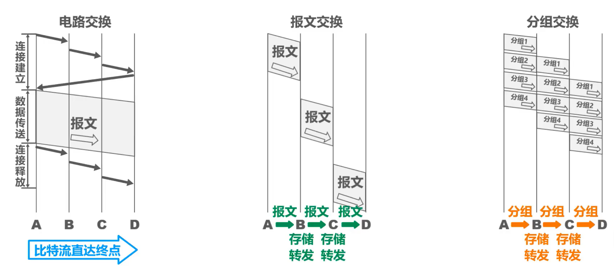

分析：

电路交换：

* 通信之前首先要建立连接；连接建立好之后，就可以使用已建立好的连接进行数据传送；数据传送后，需释放连接，以归还之前建立连接所占用的通信线路资源。

* 一旦建立连接，中间的各结点交换机就是直通形式的，比特流可以直达终点；

报文交换：

* 可以随时发送报文，而不需要事先建立连接；整个报文先传送到相邻结点交换机，全部存储下来后进行查表转发，转发到下一个结点交换机。
* 整个报文需要在各结点交换机上进行存储转发，由于不限制报文大小，因此需要各结点交换机都具有较大的缓存空间。

分组交换：

* 可以随时发送分组，而不需要事先建立连接。构成原始报文的一个个分组，依次在各结点交换机上存储转发。各结点交换机在发送分组的同时，还缓存接收到的分组。
* 构成原始报文的一个个分组，在各结点交换机上进行存储转发，相比报文交换，减少了转发时延，还可以避免过长的报文长时间占用链路，同时也有利于进行差错控制。

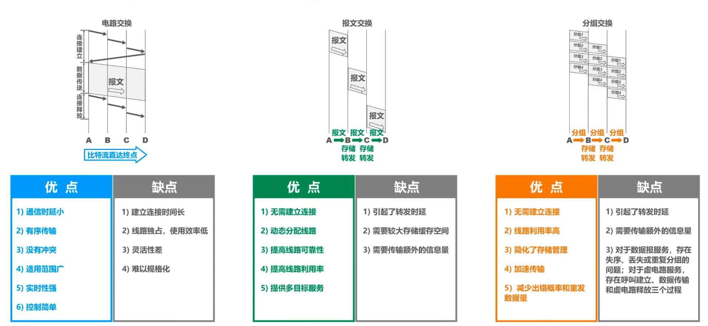

------

<h2 id="1.4">1.4 计算机网络的定义和分类</h2>

### 定义

* 计算机网络的精确定义并未统一
* 计算机网络的最简单的定义是：一些**互**相**连**接的、**自治**的计算机的**集合**。
  * 互连：是指计算机之间可以通过有线或无线的方式进行数据通信；
  * 自治：是指独立的计算机，他有自己的硬件和软件，可以单独运行使用；
  * 集合：是指至少需要两台计算机；
* 计算机网络的较好的定义是：计算机网络主要是由一些**通用的，可编程的硬件（一定包含有中央处理机CPU）互连**而成的，而这些硬件并非专门用来实现某一特定目的（例如，传送数据或视频信号）。这些可编程的硬件能够用来**传送多种不同类型的数据**，并能**支持广泛的和日益增长的应用**。
  * 计算机网络所连接的硬件，并不限于一般的计算机，而是包括了智能手机等智能硬件。
  * 计算机网络并非专门用来传送数据，而是能够支持很多种的应用（包括今后可能出现的各种应用）。
::: tip 
* 从构成的角度来看，互联网由三个部分组成：核心部分、接入网、边缘部分
* 从**服务**的角度来看，互联网是分布式的应用进程以及为分布式进程提供通信服务的基础设施。
    * 使用通信设施进行通信的分布式应用。
        * 浏览器、Email、在线游戏、社交网络...
    * 通信设施为应用提供**编程接口**。将收发数据的应用与互联网连接起来。
        * 无连接不可靠服务UDP
            * 传输速度快
            * 直播、远程会议、DNS、网络电话
        * 面向连接可靠服务TCP
            * 不丢失不出错不重复不失序
            * HTTP、FTP
:::

### 分类

#### 1. 按交换技术分类：

* 电路交换网络
* 报文交换网络
* 分组交换网络

#### 2. 按使用者分类：

* 公用网
* 专用网

#### 3. 按传输介质分类：

* 有线网络
* 无线网络

#### 4. 按覆盖范围分类：

* 广域网 `WAN`（**Wide Area Network**）

作用范围通常为几十到几千公里，因而有时也称为远程网（long haul network）。广域网是互联网的核心部分，其任务是通过长距离（例如，跨越不同的国家）运送主机所发送的数据。

* 城域网 `MAN`（**Metropolitan Area Network**）

作用范围一般是一个城市，可跨越几个街区甚至整个城市。

* 局域网 `LAN`（**Local Area Network**）

一般用微型计算机或工作站通过高速通信线路相连（速率通常在 10 Mbit/s 以上），但地理上范围较小（1 km 左右）。
如学校或企业大都拥有多个互连的局域网（校园网、企业网）。

* 个域网 `PAN`（**Personal Area Network**）

就是在个人工作的地方把个人使用的电子设备用无线技术连接起来的网络。

#### 5. 按拓扑结构分类：

* 总线型网络

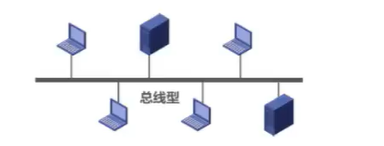

* 星型网络

* 环形网络

* 网状型网络

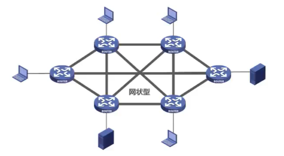

------

<h2 id="1.5">1.5 计算机网络的性能指标</h2>

### 1. 速率
网络上的主机在数字信道上传送比特的速率。也称比特率或数据率。

### 2. 带宽
网络通信线路传输数据的能力，“最高数据率”
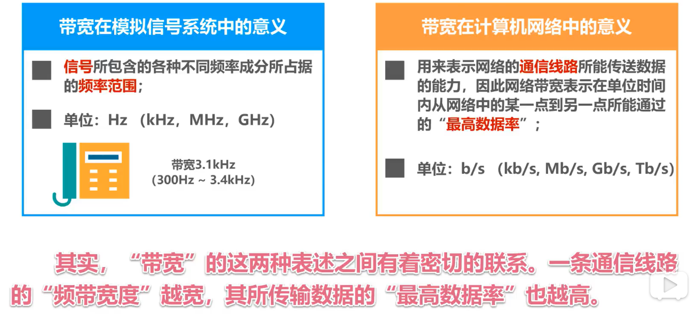

### 3. 吞吐量
单位时间内通过某个接口、信道的实际数据量。

> 带宽1 Gb/s的以太网，代表其额定速率是1 Gb/s，这个数值也是该以太网的**吞吐量的绝对上限值**。因此，对于带宽1 Gb/s的以太网，可能实际吞吐量只有 700 Mb/s，甚至更低。
>
> 注意：吞吐量还可以用每秒传送的字节数或帧数表示

>作类比，带宽是指单位时间内最大水流量，即水管的粗细程度；速率是指实际水流速率；吞吐量指单位时间内流过的水量有多少。

### 4. 时延

时延时指数据（一个报文或分组，甚至比特）从网络（或链路）的一端传送到另一端所需的时间。

网络时延由几部分组成：

* **发送时延**
    * 主机或路由器发送数据帧所需要的时间，也就是从发送数据帧的第一个比特算起，到该帧的最后一个比特发送完毕所需的时间。
    * 分组长度（bits）/链路带宽（bps）
* **传播时延**
    * 电磁波在信道中传播一定的距离需要花费的时间。
* 处理时延
    * 主机或路由器在收到分组时要花费一定时间进行处理
* 排队时延
    * 分组在进过网络传输时，要经过许多路由器。但分组在进入路由器后要先在输入队列中排队等待处理。

> 有时会把排队时延看成**处理时延 一部分**
>
> 总时延 = 发送时延 + 传播时延 + 处理时延 （处理时延 + 排队时延）

> 当处理时延忽略不计时，发送时延 和 传播时延谁占主导，要具体情况具体分析

### 5. 时延带宽积

时延带宽积 = 传播时延 * 带宽

### 6. 往返时间

互联网上的信息不仅仅单方向传输而是双向交互的。因此，我们有时很需要知道**双向交互一次所需的时间**。

### 7. 利用率

利用率有**信道利用率**和**网络利用率**两种。

  

### 8. 丢包率

------

<h2 id="1.6">1.6 计算机网络体系结构</h2>

### 1、常见的计算机网络体系结构

#### 1. OSI结构
::: tip OSI/RM体系结构
* 1974 年，美国的 IBM 公司宣布了系统网络体系结构SNA (System Network Architecture)。这个著名的网络标准就是按照分层的方法制定的。
* 不久后，其他一些公司也相继推出自己的体系结构。由于网络体系结构的不同，不同公司的设备很难互相连通。为了使不同体系结构的计算机网络都能互连，国际标准化组织 ISO 于 1977 年成立了专门机构研究该问题。
* 他们提出了一个试图使各种计算机在世界范围内互连成网的标准框架，即著名的**开放系统互连基本参考模型** OSI/RM (Open Systems Interconnection Reference Model)，简称为 OSI。
* 只要遵循 OSI 标准，一个系统就可以和位于世界上任何地方的、也遵循这同一标准的其他任何系统进行通信。
* 因为种种原因，OSI标准并未成功实行。
:::

* 如今用的最多的是TCP/IP体系结构，现今规模最大的、覆盖全球的、基于TCP/IP的互联网并未使用OSI标准。
* TCP/IP体系结构相当于将OSI体系结构的**物理层**和**数据链路层**合并为了**网络接口层**，并去掉了**会话层**和**表示层**。
* TCP/IP在网络层使用的协议是IP协议，IP协议的意思是网际协议，因此**TCP/IP体系结构的网络层称为网际层**

#### 2. TCP/IP协议族

* 在用户主机的操作系统中，通常都带有符合TCP/IP体系结构标准的TCP/IP协议族。
* 而用于网络互连的路由器中，也带有符合TCP/IP体系结构标准的TCP/IP协议族。
* 只不过路由器一般只包含网络接口层和网际层。

* **网络接口层**：并没有规定具体内容，这样做的目的是可以互连全世界各种不同的网络接口，例如：有线的以太网接口，无线局域网的WIFI接口等。
* **网际层**：它的核心协议是IP协议。
* **运输层**：TCP和UDP是这层的两个重要协议。
* **应用层**：这层包含了大量的应用层协议，如 HTTP , DNS 等。
* **IP协议（网际层）**可以将不同的**网络接口（网络接口层）**进行互连，并向其上的**TCP协议和UDP协议（运输层）**提供网络互连服务
    而**TCP协议**在享受IP协议提供的网络互连服务的基础上，可向**应用层的相应协议**提供**可靠**的传输服务。
* **UDP协议**在享受IP协议提供的网络互连服务的基础上，可向**应用层的相应协议**提供**不可靠**的传输服务。

TCP/IP体系结构中最重要的是**IP协议**和**TCP协议**，因此用TCP和IP来表示整个协议大家族。

> 教学时把TCP/IP体系结构的**网络接口层**分成了**物理层**和**数据链路层**

### 2、计算机网络体系结构分层的必要性

::: tip 分层设计的必要性
* 计算机网络是个 **非常复杂** 的系统。
* 相互通信的两个计算机系统必须高度协调工作才行，而这种“协调”是相当复杂的。 
* “分层”可将庞大而复杂的问题，转化为若干较小的局部问题，而这些较小的局部问题就比较易于研究和处理。 
:::

#### 1. **物理层问题**

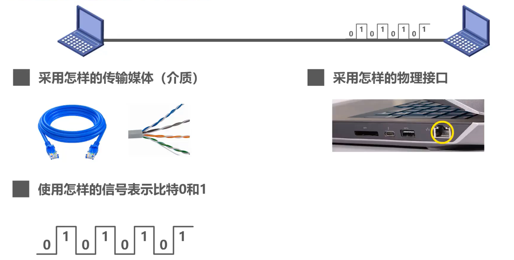
物理层的任务：为数据通信提供**实际的物理线路和通信信道**。信息的载体可以是电信号、光信号等。但在物理层协议下，信息被看作 **比特流**。
> 这图说明
>
> * 第一，严格来说，传输媒体并不属于物理层
> * 计算机传输的信号，并不是图示的方波信号
>
> 这样举例只是让初学者容易理解

#### 2. **数据链路层问题**

数据链路层的任务：为同一网络（局域网）的数据通信提供了虚拟信道，可以根据不同链路类型对物理层的比特流进行帧封装和传输。负责直接相连的结点数据传输。

#### 3. **网络层问题**

网络层的任务：为不同网络间的数据通信提供了数据包的路由转发、寻址功能。实现**主机之间**的通信，也叫点对点通信。

#### 4. **运输层问题**

>如何标识与网络通信相关的应用进程：一个分组到来，我们应该交给哪个进程处理呢？浏览器进程还是QQ进程

#### 5. **应用层问题**

> 应用层该用什么方法（应用层协议）去解析数据

**总结**

事实上，每一层所做的工作大体都只有两类：
* 第一类工作与传送文件直接有关。
    * 确信对方已做好接收和存储文件的准备。
    * 双方已协调好一致的文件格式。
* 两个主机将文件传送模块作为最高的一层 ，剩下的工作由下面的模块负责。

### 3、计算机网络体系结构分层思想举例
#### 例1：主机 1 向主机 2 发送数据

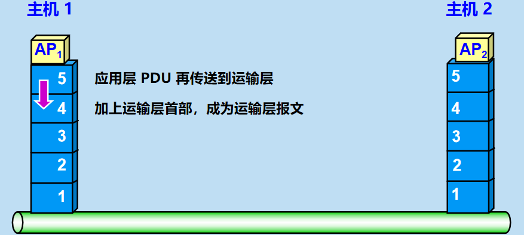
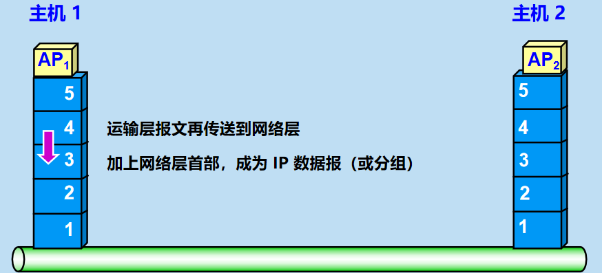
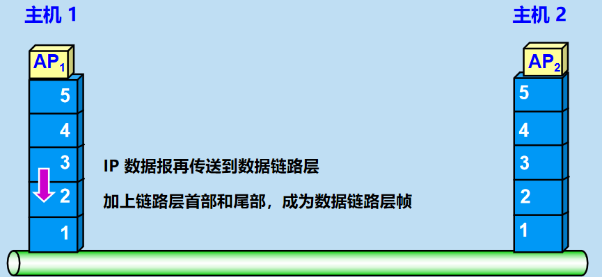
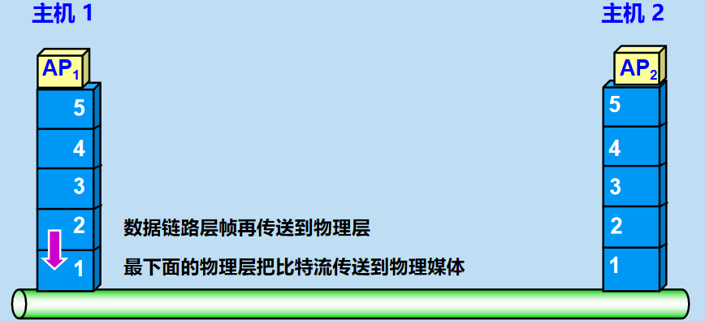

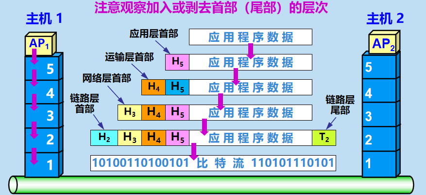
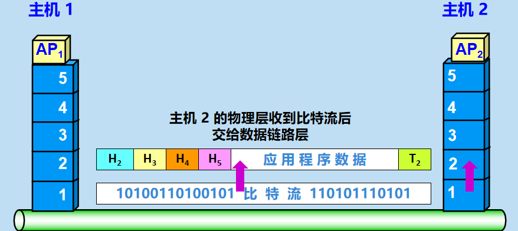
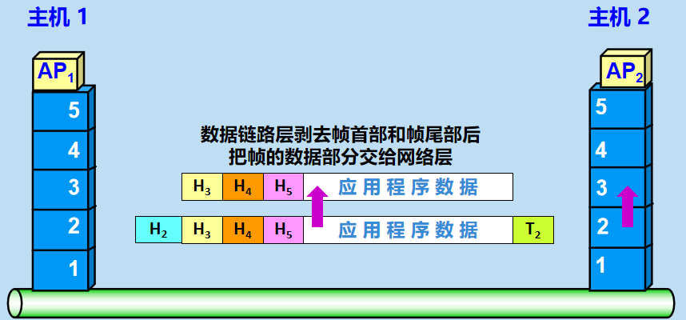

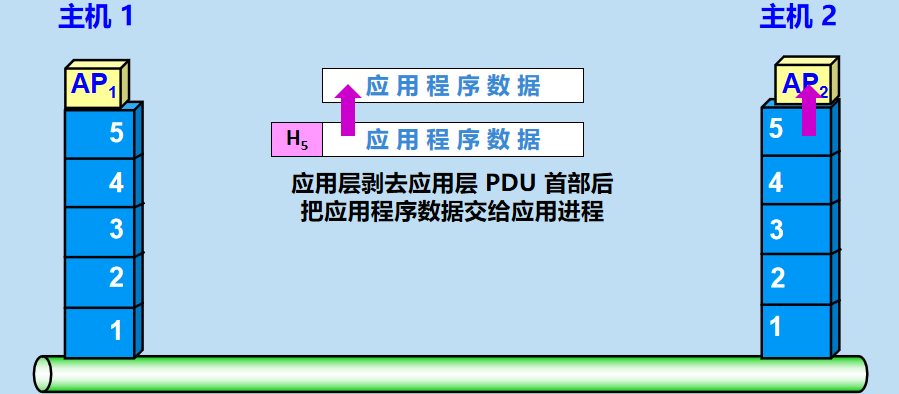
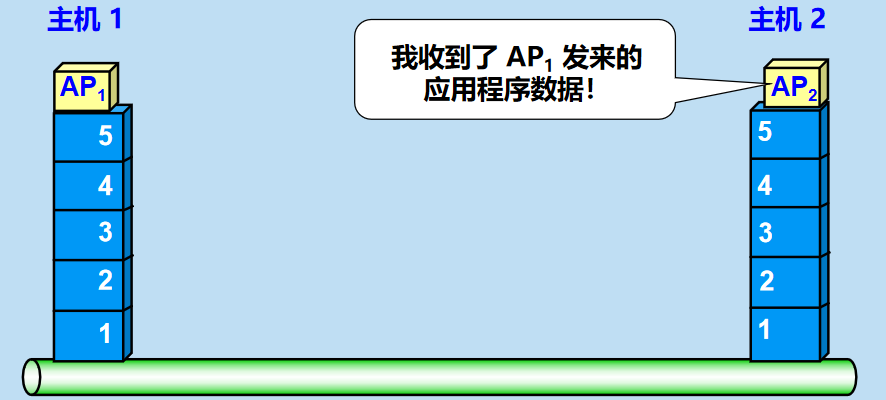

#### 例2：主机的浏览器如何与Web服务器进行通信

**解析：**

主机和Web服务器之间基于网络的通信，实际上是主机中的**浏览器应用进程**与Web服务器中的**Web服务器应用进程**之间基于**网络的通信**

**体系结构的各层在整个过程中起到怎样的作用？**

**1、发送方发送**

> 第一步：
>
> * **应用层**按照HTTP协议的规定构建一个**HTTP请求报文**
> * 应用层将**HTTP请求报文**交付给**运输层**处理

> 第二步：
>
> * **运输层**给**HTTP请求报文**添加一个**TCP首部**，使之成为**TCP报文段**
> * **TCP报文段的首部格式**作用是区分应用进程以及实现可靠传输
> * **运输层**将T**CP报文段**交付给**网络层**处理

> 第三步：
>
> * **网络层**给**TCP报文段**添加一个**IP首部**，使之成为**IP数据报**
> * **IP数据报的首部格式**作用是使**IP数据报**可以在互联网传输，也就是被路由器转发
> * **网络层**将**IP数据报**交付给**数据链路层**处理

> 第四步：
>
> * **数据链路层**给**IP数据报**添加一个**首部**和一个**尾部**，使之成为**帧**     （图示右边为首部，左边为尾部） 
> * 该**首部**的作用主要是为了让**帧**能够在一段链路上或一个网络上传输，能够被相应的目的主机接收
> * 该**尾部**的作用是让目的主机检查所接收到的**帧**是否有误码
> * **数据链路层**将**帧**交付给**物理层**

> 第五步：
>
> * **物理层**先将**帧**看做是**比特流**，这里的网络N1假设是以太网，所以**物理层**还会给该**比特流**前面添加**前导码**
> * **前导码**的作用是为了让目的主机做好接收帧的准备
> * **物理层**将装有**前导码**的**比特流**变换成相应的**信号**发送给传输媒体

> 第六步：
>
> * **信号**通过**传输媒体**到达**路由器**

**2、路由器转发**

> 在路由器中
>
> * **物理层**将**信号**变为**比特流**，然后去掉**前导码**后，将其交付给**数据链路层**
> * **数据链路层**将**帧**的**首部**和**尾部**去掉后，将其交付给**网络层**，这实际交付的是**IP数据报**
> * **网络层**解析**IP数据报**的**首部**，从中提取**目的网络地址**

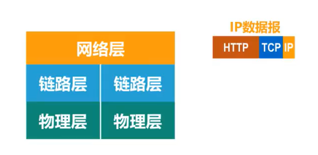

> 在路由器中
>
> * 提取**目的网络地址**后查找**自身路由表**。确定**转发端口**， 以便进行转发
> * **网络层**将**IP数据报**交付给**数据链路层**
> * **数据链路层**给**IP数据报**添加一个**首部**和一个**尾部**，使之成为**帧**
> * **数据链路层**将帧交付给**物理层**
> * **物理层**先将**帧**看成**比特流**，这里的网络N2假设是以太网，所以**物理层**还会给该**比特流**前面添加**前导码**
> * 物理层将装有**前导码**的**比特流**变换成相应的**信号**发送给传输媒体，信号通过传输媒体到达**Web服务器**

**3、接收方接收**

> 和发送方（主机）发送过程的封装正好是反着来
>
> 在Web 服务器上
>
> * **物理层**将**信号**变换为**比特流**，然后去掉**前导码**后成为**帧**，交付给**数据链路层**
> * **数据链路层**将**帧**的**首部**和**尾部**去掉后成为**IP数据报**，将其交付给**网络层**
> * **网络层**将**IP数据报**的**首部**去掉后成为**TCP报文段**，将其交付给**运输层**
> * **运输层**将**TCP报文段**的**首部**去掉后成为**HTTP请求报文**，将其交付给**应用层**
> * **应用层**对**HTTP请求报文**进行**解析**，然后给主机发回**响应报文**
>
> **发回响应报文的步骤和之前过程类似**

### 4、计算机网络体系结构中的专用术语

以下介绍的专用术语来源于OSI的七层协议体系结构，但也适用于TCP/IP的四层体系结构和五层协议体系结构

#### 实体 (*entity*)

#### 协议 (*protocol*)

* **协议**是控制两个对等实体进行逻辑通信的**规则**的集合，它定义了通信实体之间交换的报文格式和次序，以及报文发送或接收或其他事件所采取的动作。
    * **各层协议**实际上就是在各个**对等层**之间传递数据时的各项规定。
* 协议三要素：
    * **语法**：定义所交换信息的格式，即数据与控制信息的结构或格式 。
    * **语义**：定义收发双方所要完成的操作，需要发出何种控制信息，完成何种动作以及做出何种响应。
    * **同步**：定义收发双发的时序关系，对事件实现顺序的详细说明。
* 协议的两种形式：
    * 便于人来阅读和理解的**文字描述**。
    * 让计算机能够理解的**程序代码**。
* 协议是非常**复杂**的。
    * 协议必须把所有不利的条件事先都估计到，而不能假定一切都是正常的和非常理想的。 
    * 看一个计算机网络协议是否正确，不能光看在正常情况下是否正确，还必须非常仔细地检查这个协议能否应付各种异常情况。 

#### 服务 (*service*)

#### 协议数据单元PDU (Protocol Data Unit)

OSI 参考模型**对等层次**之间传送的**数据单位**。

#### 服务访问点 (*Service Access Point*)
* 同一系统相邻两层的实体进行交互的地方，称为**服务访问点** SAP (Service Access Point)。 
* 服务访问点SAP是一个抽象的概念，它实际上就是一个逻辑接口。
* OSI把**层与层之间**交换的数据的单位称为**服务数据单元** SDU (Service Data Unit)。
* SDU 可以与 PDU 不一样，例如，可以是多个 SDU 合成为一个 PDU，也可以是一个 SDU 划分为几个 PDU。
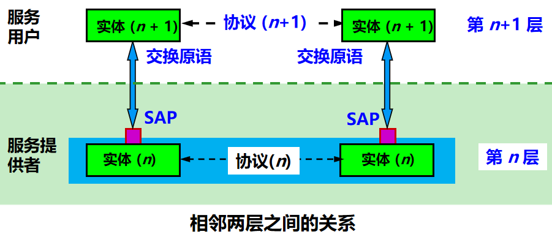

## 场景：腾讯QQ发送消息
A在家里用手机通过WiFi使用腾讯QQ给远在万里之外的B发消息。
### 1. 手机连接WiFi

首先，A的手机连接到家里的WiFi网络，即A的手机通过无线信号与家庭路由器建立连接。
- **SSID**：A的手机选择并连接到家里WiFi网络的名称（SSID），输入WiFi密码，通过认证后成功连接到路由器。
- **DHCP**：路由器通过DHCP（动态主机配置协议）分配给A的手机一个本地IP地址，比如192.168.1.5。

#### SSID是什么？

SSID（Service Set Identifier，服务集标识符）是无线网络（WiFi）中用于标识网络名称的一个**唯一标识符**。它用来区分不同的无线网络，使得无线设备（如手机、笔记本电脑等）能够识别并连接到特定的无线网络。

#### SSID的作用

1. **网络标识**：SSID充当无线网络的名称，使设备可以区分并选择要连接的网络。它在网络扫描列表中显示，用户可以根据SSID选择要连接的网络。

2. **连接管理**：设备通过SSID选择并连接到特定的无线网络。多个无线网络可能在同一区域内存在（如邻居的WiFi网络），SSID帮助设备确定正确的连接目标。

3. **安全管理**：尽管SSID本身不提供安全性，但它可以与加密协议（如WPA2、WPA3）一起使用，确保只有授权用户能够连接到网络。

#### SSID的工作原理

1. **广播SSID**：无线接入点（AP，通常是路由器）会周期性地广播SSID。这使得附近的无线设备可以检测到网络的存在，并将其显示在可用网络列表中。

2. **SSID名称**：SSID名称是一个可读字符串，最多可以包含32个字符。它可以由字母、数字和一些特殊字符组成。常见的SSID示例如：“HomeWiFi”、“OfficeNetwork”、“CoffeeShop”。

3. **连接过程**：
   - **扫描网络**：无线设备扫描附近的无线网络，捕获所有广播的SSID。
   - **选择网络**：用户从扫描结果中选择要连接的SSID。
   - **身份验证**：如果选择的SSID受密码保护，用户需要输入正确的密码。路由器验证密码并允许连接。
   - **获取IP地址**：连接成功后，设备通过DHCP（动态主机配置协议）获取网络配置，包括IP地址、子网掩码和网关。

#### SSID和安全

- **隐藏SSID**：有些网络选择隐藏SSID，即不广播SSID。这增加了一层安全性，因为用户必须手动输入SSID才能连接。但这并不能完全防止网络攻击，因为SSID仍然可以通过网络嗅探工具检测到。
- **加密协议**：常见的无线加密协议包括WEP、WPA、WPA2和WPA3。选择强加密协议（如WPA3）和强密码可以显著提高网络安全性。

#### SSID的管理

- **更改SSID**：用户可以通过路由器的管理界面更改SSID名称。这在设置新网络或防止冲突时很有用。
- **多个SSID**：一些高级路由器允许创建多个SSID，以便创建不同的网络（如访客网络和主网络），并分别管理其安全设置。

通过SSID，无线网络能够有效地标识和管理连接，确保设备能够正确连接到期望的网络并进行通信。在家里用手机连接WiFi的过程中，选择正确的SSID是连接到家庭网络的第一步。

### 2. DNS解析

A打开腾讯QQ应用并准备发送消息。此时，腾讯QQ需要连接到腾讯的服务器，但手机只知道服务器的域名，需要通过DNS解析得到服务器的IP地址：

- **DNS请求**：A的手机向家庭路由器发送DNS请求，询问qq.com的IP地址。
- **DNS服务器查询**：路由器将请求转发给ISP的DNS服务器。
- **DNS响应**：DNS服务器返回qq.com的IP地址，比如123.456.789.10。

### 3. 建立TCP连接

腾讯QQ使用传输控制协议（TCP）与腾讯服务器建立连接：

- **三次握手**：手机和腾讯服务器通过三次握手建立可靠的TCP连接。
  1. 手机发送SYN（同步）包到服务器。
  2. 服务器回应SYN-ACK（同步-确认）包。
  3. 手机回应ACK（确认）包，连接建立。

### 4. SSL/TLS加密

为了确保消息的安全，腾讯QQ可能会使用SSL/TLS协议对通信进行加密：

- **握手过程**：手机和服务器进行SSL/TLS握手，协商加密算法和密钥。
- **加密通信**：后续的所有通信内容都被加密，确保消息在传输过程中不会被窃听或篡改。

### 5. 数据传输

A通过腾讯QQ发送消息给B：

- **消息封装**：消息被封装成数据包，通过TCP连接发送到腾讯的服务器。
- **路由转发**：家庭路由器将数据包发送到ISP的网络中，通过互联网的路由器逐跳转发，最终到达腾讯的服务器。

### 6. 服务器处理

腾讯的服务器接收到A的消息后，进行以下处理：

- **验证和处理**：服务器验证A的身份，检查消息内容，并查找B的在线状态和位置。
- **转发消息**：服务器将消息存储在数据库中，并根据B的在线状态，决定是立即推送消息还是暂存等待B上线。

### 7. B接收消息

B的手机通过网络接收到来自腾讯服务器的消息：

- **推送通知**：如果B在线，腾讯服务器会通过推送通知将消息发送到B的手机。
- **B手机响应**：B的手机收到推送通知后，通过TCP连接向腾讯服务器请求消息数据。
- **消息显示**：腾讯服务器将消息数据发送给B的手机，B的手机解密数据并在腾讯QQ应用中显示消息。

### 8. 网络层次

1. **物理层和数据链路层**：WiFi连接、家庭路由器的物理通信。
2. **网络层**：IP地址分配、路由器转发数据包。
3. **传输层**：TCP协议建立连接、保证数据可靠传输。
4. **应用层**：DNS解析、SSL/TLS加密、消息封装和传输。